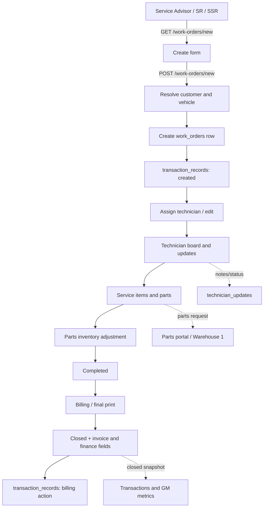

# Current Operations Flow

Status: documentation of the runtime behavior as of 2026-09-02.

This document describes the current Work Order flow, portal-specific runtime surfaces, and the General Manager (GM) metric pipeline. It is intentionally additive: it does not define a second workflow and does not change business behavior.

## Runtime shape

The application has one Express runtime. `app-admin.js` and `app-gm.js` set the intended port/bypass environment and then load `app.js`; they do not create separate business-logic applications. The default ports are 3000 for `app.js` and 3002 for `app-gm.js` when `PORT` is not already set.

Request processing in `app.js` is ordered as follows:

1. Helmet, body parsers, session middleware, and static assets are installed.
2. Session locals are populated, including the active portal, portal label, accessible portals, approval count, and grant helper.
3. Authentication is enforced unless login bypass is enabled.
4. `portalForPath()` and `canEnterPortal()` enforce portal entry. Limited-view grants are GET/HEAD only.
5. Frontline users are given a required branch scope. Work Order create/edit requests are forced to the signed-in branch and service-advisor identity; existing Work Orders from another branch are rejected.
6. Delete requests pass through the configured delete-password gate.
7. Route-level role/grant guards run, then the route handlers read or mutate the shared store.

The shared persistence model is normalized by `data/store.js`. The collections most relevant to this flow are:

- `work_orders`: the current Work Order, lifecycle status, assignments, service items, and invoice/finance fields.
- `customers` and `vehicles`: records referenced by a Work Order.
- `technician_updates`: technician status, notes, and Service-to-Technician communication.
- `transaction_records`: the audit/event ledger used by transaction views and GM closed-revenue calculations.
- `parts_inventory` and `parts_request_transactions`: parts movement, requests, and fulfillment state.
- `approval_requests`: cross-portal approval queue.
- `pricing_settings`, `branches`, and `employees`: pricing, branch catalog, and staff inputs used by dashboards.

## Work Order flow

The route is mounted at `/work-orders` from `routes/workorders.js`. It is classified as the Service portal by `lib/portals.js`, but its records are consumed by Parts, Finance, STM, Technician, and GM surfaces.



### Entry and creation

- `GET /work-orders` lists open work first, then closed work, ordered by created time or fallback Work Order number.
- `GET /work-orders/new` scopes customer/vehicle choices for a frontline branch, loads the vehicle catalog, branch options, and the technician directory. A `copyFrom` request is accepted only within the signed-in branch.
- `POST /work-orders/new` applies catalog vehicle type, resolves or creates the customer and vehicle, assigns a seven-digit Work Order number, canonicalizes the branch, and sets the initial lifecycle status. A technician assignment records `technician_assigned_at` and `time_in`. It writes a `created` transaction record.

### Editing, service, and technician communication

- `GET/POST /work-orders/:id/edit` loads or updates the header, customer, vehicle, branch, assignment, times, and status. Closed Work Orders are locked. Frontline branch enforcement also applies at the global middleware layer.
- `GET/POST /work-orders/:id/service` loads service pricing and a parts catalog, normalizes service lines, and applies the difference between old and new parts quantities to inventory. It writes a `service-updated` transaction record. Closed Work Orders cannot be changed.
- `POST /work-orders/:id/technician-update` creates a `technician_updates` message for the assigned technician.
- `GET /work-order-transactions/technicians` is the Service transaction/technician board. Its POST status actions create `technician_updates` and synchronize the Work Order to `in-progress`, `waiting-parts`, `break`, or `on-other-priority` where applicable.
- `/technician` is separately role-guarded. A technician can see only matching assignments, post notes/status changes, and request parts for an assigned Work Order. `done` changes the Work Order to `completed` and fills `time_out` when absent.

### Billing and closure

- `GET /work-orders/:id/billing` builds a printable invoice from the Work Order service items, applying the configured VAT rate.
- `POST /work-orders/:id/billing/save-pdf` saves a billing PDF copy without closing the Work Order.
- `POST /work-orders/:id/billing/final-print` validates the requested print/Viber/email action, computes invoice economics from the parts cost index, sets `closed`, invoice number/date, payment fields, and `time_out`, saves the PDF, and writes a `billing-*` transaction record.
- `GET /transactions/closed-work-order-search` searches closed Work Orders by number, customer, plate, or vehicle and redirects to billing. `/transactions` and its exports read `transaction_records`, with frontline branch filtering.
- `POST /work-orders/:id/delete` soft-audits as `deleted` and then removes the Work Order. The global delete-password middleware applies when enabled.

## Portal map and portal-specific scripts

Portal entry and grants are centralized in `lib/portals.js`. The path classifier maps `/work-orders`, `/work-order-transactions`, `/customers`, `/vehicles`, `/technician`, `/stm`, and `/service-receptionist` to Service; `/parts`, `/parts-manager`, `/parts-portal`, and `/branch-parts` to Parts; `/stores` to Stores; `/hr` and `/employees` to HR; `/gm` and `/api/gm` to GM; and `/finance` plus `/admin` to Finance Office. `/approvals`, `/transactions`, and `/helper` are shared routes with their own checks.

| Portal or role surface | Main server routes | Browser scripts and purpose |
| --- | --- | --- |
| Service Advisor / SR / SSR | `/service-receptionist`, `/service`, `/work-orders` | `public/js/sa-revenue-bars.js` for branch pacing; `vehicle-type-catalog.js` and `work-order-status.js` on Work Order forms |
| Technician | `/technician` | No portal-specific script; server-rendered assigned Work Orders and POST updates |
| STM | `/stm`, `/api/stm/*`, `/kpi` | `public/js/stm-dashboard.js` for live technician/branch monitoring |
| Parts Clerk / Parts portal | `/parts-portal`, `/parts` | `public/js/parts-report-modal.js` for report details |
| Parts Manager | `/parts-manager`, `/branch-parts` | `pm-workspace.js`, `parts-manager-dashboard.js`, `parts-manager-nav.js`, and `parts-report-modal.js` for workspace panels, approvals, transfers, inventory, and reports |
| Stores | `/stores`, `/stores/pos` | No dedicated portal script; server-rendered POS, shelving, and store views |
| HR | `/hr`, `/employees` | No dedicated portal script; server-rendered HR, roster, payroll, and employee views |
| Finance Office | `/finance`, `/admin`, `/api/finance` | `finance-workspace.js` for finance workspace interactions |
| GM | `/gm`, `/api/dashboard/metrics`, `/api/gm/*` | No GM-specific browser script in the current view; dashboard data is rendered by EJS and the metrics API |

Access is role/grant based rather than determined by the browser script. The GM role has all grants; PM and Finance Manager/Accounting have cross-portal limited views as configured in `ROLE_GRANTS`. Frontline roles additionally carry a branch identity, and branch scoping is enforced server-side.

### Recent parts cross-portal handoff

The current branch-parts handoff is:

1. A branch user saves a draft at `/branch-parts/orders` or sends an order to Warehouse 1.
2. Before sending, Warehouse 1 on-hand is checked. A shortage leaves the order unsent, records a stock alert/request, and notifies Parts Manager.
3. Parts Manager approval/print creates an in-transit fulfillment record. The transfer is not complete at approval or print alone.
4. The requesting branch uses `/branch-parts/receive/:id` to verify receipt. The server deducts Warehouse 1 lots, creates the branch restock row, closes linked request transactions, marks the source request received, and reconciles stock alerts.
5. `WAREHOUSE_1` is restricted to restock and transfer behavior; branch operational locations hold the received stock.

This handoff is represented across `routes/branch-parts.js`, `routes/parts-manager.js`, `lib/parts-transfer-receive.js`, `lib/parts-stock-alerts.js`, and `lib/parts-location-scope.js`.

## GM metric pipeline

The GM dashboard is assembled in `app.js` by `loadGmDashboardPage()` and `buildGmMetrics()`. The same builder feeds the HTML page at `/gm` and the JSON endpoint `/api/dashboard/metrics`; the endpoint is restricted to `ROLE_GENERAL_MANAGER`.

```mermaid
flowchart LR
    A[store: work_orders] --> D[buildGmMetrics]
    B[store: transaction_records] --> D
    C[store: employees, branches] --> D
    E[pricing_settings] --> D
    F[parts_inventory] --> D
    D --> G[period and duration window]
    G --> H[KPIs and revenue]
    G --> I[branch milestones]
    G --> J[technician performance]
    G --> K[top services / technicians]
    G --> L[markup health and negative reports]
    H --> M[gmDashboardTemplateVars]
    I --> M
    J --> M
    K --> M
    L --> M
    M --> N[/gm EJS]
    D --> O[serializeGmDashboardPayload]
    O --> P[/api/dashboard/metrics JSON]
```

### Inputs and calculation rules

1. `work_orders` supplies open/pending counts, current assignments, created-date pacing, aging risks, and the completed-but-not-yet-billed pipeline.
2. `transaction_records` is reduced to the latest snapshot for each transaction identity. Its closed/billing records are the source for GM recognized revenue, closed count, average ticket, top services, and top technicians.
3. The report date resolves a Manila-time day/week/month period. The optional duration (`H`, `D`, `W`, `M`, `Y`, or `ALL`, as normalized by the existing helpers) creates the active revenue window and cumulative comparison window.
4. Branch milestones combine Work Order activity, transaction snapshots, branch catalog data, and sales targets from `pricing_settings.gm_branch_sales_targets`. Proposed/pipeline branches are retained in raw metrics but excluded from dashboard matrix totals and company averages.
5. KPI fields include active/open Work Orders, closed Work Orders, pending billing count, active technicians, window revenue, cumulative revenue, average ticket, pending spark buckets, and average operational branch metrics.
6. Technician performance uses employees, Work Orders, pricing settings, and the report period. Markup health uses Work Orders, transaction snapshots, parts inventory, employees, pricing settings, and the active window.
7. `gmDashboardTemplateVars()` builds HTML-only matrix totals, pacing segments, spark heights, labels, and display values. `serializeGmDashboardPayload()` produces the smaller API contract with cards, pacing, matrix rows, markup health, negative reports, and targets.

Important boundary: GM revenue is transaction-ledger based, while open/pending and pacing signals are Work Order based. A Work Order becoming `completed` contributes to pending billing until final billing creates the closed transaction snapshot.

## Recent cross-portal changes

The following recent commits explain the current portal boundaries and handoffs:

| Commit | Change | Operational effect |
| --- | --- | --- |
| `e40384d` | Regroup operations into Service, Parts, Stores, and HR portals | Added the centralized portal registry, department/role routing, shared header navigation, and portal access model. |
| `0ef11e0` | Add Parts Manager and Finance Manager portals | Added PM workspace and Finance Office routes, ledgers, documents, and role-aware Work Order/finance integrations. |
| `8647f36` | Wire login role lists to each department | Login department selection now drives the available role choices. |
| `a06a27e` | Authorize cloud logins from `employee-db-all.csv` | Employee login provisioning and authorization use department, role, employee ID, location, and the temporary password policy. |
| `dd05583` | Restore GM login as `GM` | Restored the dedicated GM login path and account behavior. |
| `ee35800` | Keep Warehouse 1 as restock and transfer only | Restricted Warehouse 1 location semantics and aligned parts reporting/request behavior. |
| `04e1dac` | Complete branch parts transfers after PM print and branch receipt | Added explicit in-transit fulfillment and branch receipt confirmation; approval/print no longer implies receipt. |
| `3ee142c` | Run the 10 percent branch-parts flow | Added a reproducible flow helper/API and package scripts for the branch request, PM approval, and receipt scenario. |

These are documentation anchors, not a migration checklist. The source of truth remains the route, portal, and library code named above.

## Verification notes

- This change adds only this Markdown file.
- Existing modified files in the worktree were left untouched.
- No route, data schema, permission, metric formula, or browser script was changed.
- The cheapest repository check for this documentation-only change is `git diff --check`; runtime behavior should remain unchanged because no executable file was edited.